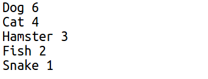
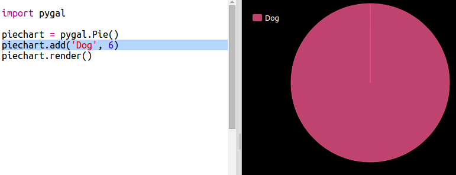
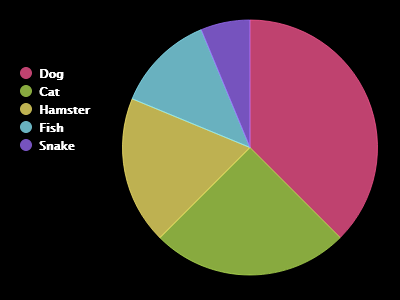

<h2 class="c-project-heading--task">Create a Pie Chart</h2>

Pie Charts are useful way of showing data.

<h2 class="c-project-heading--explainer">Follow these instructions</h2>

## Step 1

Let's do a survey of favourite pets in your Code Club and then present the data as a Pie Chart.

Ask your club leader to help organise a survey. You could record the results on a computer connected to a projector or a whiteboard that everyone can see.

Write a list of pets and make sure everyone's favourite is included.

Then get everyone to vote for their favourite by putting their hand up when it gets called out. Only one vote each!

For example:

## Step 2

Open the blank [starter project](https://editor.raspberrypi.org/en/projects/popular-pets-starter)

## Step 3

Create a pie chart to show the results of your survey. You'll be using the PyGal library to do some of the hard work.

First import the Pygal library:

--- code ---
---
language: python
filename: main.py
line_numbers: true
line_number_start: 
line_highlights: 1
---
import pygal
--- /code ---

## Step 4

Now create a Pie chart and render (display) it:

--- code ---
---
language: python
filename: main.py
line_numbers: true
line_number_start: 
line_highlights: 3-4
---
import pygal

piechart = pygal.Pie()
piechart.render()
--- /code ---

Don't worry, it gets more interesting when you add data!

## Step 5

Add in the data for one of the pets. Use the data that you collected.

--- code ---
---
language: python
filename: main.py
line_numbers: true
line_number_start: 
line_highlights: 4
---
import pygal

piechart = pygal.Pie()
piechart.add('Dog', 6)
piechart.render()
--- /code ---

There's only one piece of data so it takes up the whole pie chart.

## Step 6

Now add the rest of the data in the same way.

For example:

--- code ---
---
language: python
filename: main.py
line_numbers: true
line_number_start: 
line_highlights: 5-8
---
import pygal

piechart = pygal.Pie()
piechart.add('Dog', 6)
piechart.add('Cat', 4)
piechart.add('Hamster', 3)
piechart.add('Fish', 2)
piechart.add('Snake', 1)
piechart.render()
--- /code ---

## Step 7

And to finish off your chart, add a title:

--- code ---
---
language: python
filename: main.py
line_numbers: true
line_number_start: 
line_highlights: 3
---
import pygal

piechart = pygal.Pie(title = 'Favourite Pet')
piechart.add('Dog', 6)
piechart.add('Cat', 4)
piechart.add('Hamster', 3)
piechart.add('Fish', 2)
piechart.add('Snake', 1)
piechart.render()
--- /code ---

## Now run your code

You should see a pie chart showing the survey results you entered.
