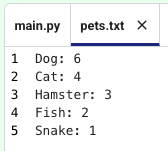

<h2 class="c-project-heading--task">Explore the data file</h2>

--- task ---
Look at the pet survey data stored in the file <code>pets.txt</code>.

--- /task ---

The file has already been added to your project.  
You can open it in the editor and change the numbers if you want to use different results.

--- code ---
---
language: text
filename: pets.txt
line_numbers: true
line_number_start: 1
line_highlights: 1-5
---
Dog: 6
Cat: 4
Hamster: 3
Fish: 2
Snake: 1
--- /code ---

--- task ---
**Test:** Open <code>pets.txt</code> in the editor by clicking the `files` button on the left:

Check that:
- each line uses the format <code>Label: number</code>
- the number is a whole number
--- /task ---

--- task ---

When you are done, come back to the instructions by clicking the `instructions` button on the left:

--- /task ---
