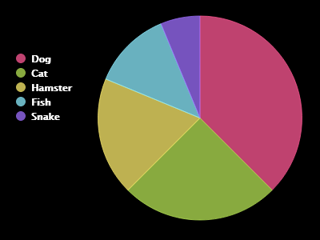

<h2 class="c-project-heading--task">Build and test - Make a pie chart from a file</h2>

--- task ---
Read the data from <code>pets.txt</code> and use it to build a pie chart.
--- /task ---

--- code ---
---
language: python
filename: main.py
line_numbers: true
line_number_start: 1
line_highlights: 1-11
---
import pygal  # Create charts in Python

pets_chart = pygal.Pie(title='Popular pets')  # Set up a pie chart with a title

with open('pets.txt', 'r') as file:  # Open the data file
    for line in file.read().splitlines():  # Read each line without newline characters
        if line:  # Skip empty lines
            label, value = line.split(': ')  # Split into label and value
            pets_chart.add(label, int(value))  # Add one slice to the chart

pets_chart.render()  # Render the chart

--- /code ---

--- task ---
**Test:** Click **Run**.

A pie chart should be generated using the data from <code>pets.txt</code>.
--- /task ---

<pre>

  </pre>

