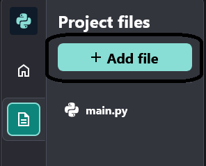
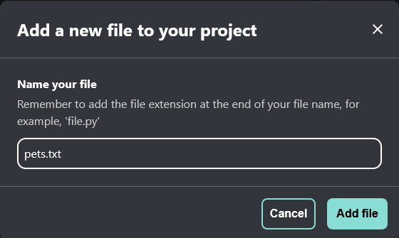
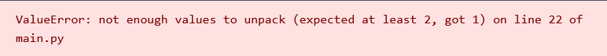

<h2 class="c-project-heading--task">Read data from a file</h2>

It is useful to be able to store data in a file, rather than having to include it in your code.

## Step 1

Add a new file to your project and call it `pets.txt`:

## Step 2

Now, add data to the file. You can use the favourite pets data that you collected or the example data here.

--- code ---
---
language: python
filename: pets.txt
line_numbers: true
line_number_start: 
line_highlights: 
---
Dog 6
Cat 4
Hamster 3
Fish 2
Snake 1
--- /code ---

## Step 3

Switch back to `main.py` and comment out the lines that render (display) charts (so that they are not displayed):

--- code ---
---
language: python
filename: main.py
line_numbers: true
line_number_start: 8
line_highlights: 9, 17
---
piechart.add('Snake', 1)
#piechart.render()

barchart = pygal.Bar(title = 'Favourite Pet')
barchart.add('Dog', 6)
barchart.add('Cat', 4)
barchart.add('Hamster', 3)
barchart.add('Fish', 2)
barchart.add('Snake', 1)
#barchart.render()
--- /code ---

## Step 4

Now, read the data from the file.

--- code ---
---
language: python
filename: main.py
line_numbers: true
line_number_start: 19
line_highlights: 19-24
---
file = open('pets.txt', 'r')

for line in file.read().splitlines():
    print(line)

file.close()
--- /code ---

The `for` loop will loop over the lines in the file. `splitlines()` will remove the newline character from the end of each line, as you do not want those.

## Step 5

You need to separate each line into a label and a value:

--- code ---
---
language: python
filename: main.py
line_numbers: true
line_number_start: 21
line_highlights: 22
---
for line in file.read().splitlines():
        label, value = line.split(' ')
        print(label, value)
--- /code ---

This will split the line at the spaces, so do not include spaces in the labels. (You can add support for spaces in labels later.)

You might get an error like this:

This happens if you have an empty line at the end of your file.

You can fix the error by only getting the label and value if the line is not empty.

## Step 6

Indent the code inside your `for` loop and add the code `if line:` above it:

--- code ---
---
language: python
filename: main.py
line_numbers: true
line_number_start: 21
line_highlights: 22
---
for line in file.read().splitlines():
    if line:
        label, value = line.split(' ')
        print(label, value)
--- /code ---

## Step 7

Now that everything is working, remove the `print(label, value)` line, and add the label and value to a new pie chart and render it:

--- code ---
---
language: python
filename: main.py
line_numbers: true
line_number_start: 19
line_highlights: 19, 26, 30
---
piechart2 = pygal.Pie()

file = open('pets.txt', 'r')

for line in file.read().splitlines():
  if line:
    label, value = line.split(' ')
    piechart2.add(label, int(value))

file.close

piechart2.render()
--- /code ---

Note that `add` expects the value to be a number. `int(value)` turns the value from a string into an integer.

If you wanted to use decimals such as 3.5 (floating-point numbers), you could use `float(value)` instead.

## Now run your code

You should see a chart created from the data in `pets.txt`.
