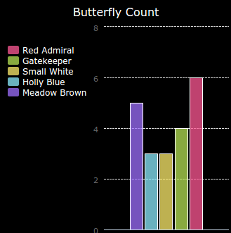

<h2 class="c-project-heading--task">Challenge: Create a new chart from a file</h2>

Can you create a new bar graph or pie chart from data in a file?

<h2 class="c-project-heading--explainer">Follow these instructions</h2>

You'll need to create a new .txt file.

Tip: If you want to have spaces in the labels then use `line.split(': ')` and add colons to your data file, e.g. 'Red Admiral: 6'

## Now run your code

Your new chart should display the data from the file you created.
