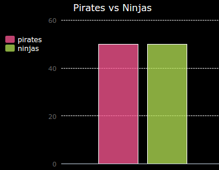
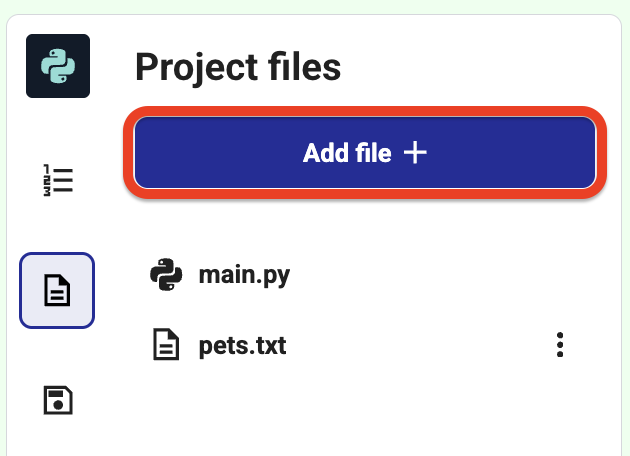

<h2 class="c-project-heading--task">Challenges: Explore more charts</h2>

--- task ---
Create **both** a pie chart and a bar graph from the **same data file**.

Use the data in <code>pets.txt</code> and display it in two different ways.  
Think about which chart makes comparisons easier.

--- /task ---

--- task ---
Create **your own bar graph** using a new question.

Choose a topic everyone will understand.  
Collect the results, update <code>pets.txt</code> (or create a new file), and generate a bar chart.

Ideas:
- Favourite sport  
- Favourite ice cream flavour  
- How you get to school  
- Birthday month  
- Do you play Minecraft? (yes/no)

Don’t collect personal data (for example, where people live).  
Ask your club leader if you’re unsure.

--- /task ---

--- task ---
Create a **new chart from a different data file**.

Add a new <code>.txt</code> file and use it to build a pie chart or bar graph. Some example files have been included for you: <code>butterflies.txt</code> and <code>piratesninjas.txt</code>

### Tip
- Create your own datafile by clicking the `Add file` button on the Project files tab:

- To allow spaces in labels, use this format in your file: <pre>Red Admiral: 6</pre>, then split each line using: <code>line.split(': ')</code>

--- /task ---

--- task ---
Let the user **choose** which chart to see.

Ask the user whether they want a **pie chart** or a **bar graph**, then show the chart they choose.

### Tip

- Use <code>input()</code> to ask the question
- Use <code>if</code> / <code>else</code> to decide which chart to render

--- /task ---
