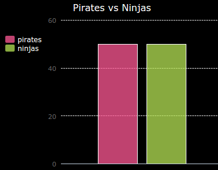
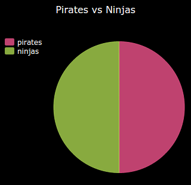

<h2 class="c-project-heading--task">Challenge: More charts and graphs!</h2>

Can you create a pie chart and a bar chart from the same file?

<h2 class="c-project-heading--explainer">Follow these instructions</h2>

You can either use the data you collected earlier or collect some new data.

## Now run your code

Your charts should both display the data from the file you used.
